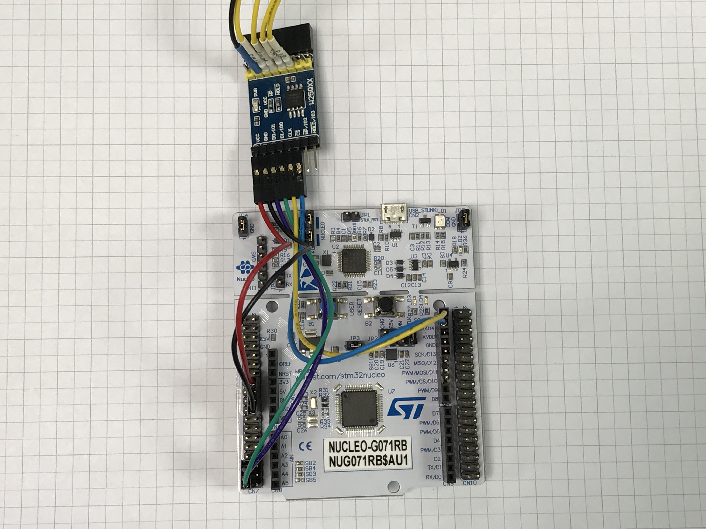

# STM32CubeProgrammer External Loader for W25Qxx in SPI

## Hardware
- [NUCLEO-G071RB](https://www.st.com/en/evaluation-tools/nucleo-g071rb.html)
- [W25QXX DataFlash Board](https://www.waveshare.com/wiki/W25QXX_DataFlash_Board) (w/ onboard W25Q128FV)

## Software
- [STM32CubeIDE](https://www.st.com/en/development-tools/stm32cubeide.html) (v1.7.0)
- [STM32CubeG0](https://www.st.com/en/embedded-software/stm32cubeg0.html) (v1.5.0)
- [STM32CubeProgrammer](https://www.st.com/en/development-tools/stm32cubeprog.html) (v2.8.0)

## Hardware Setup

| Wire   | NUCLEO-G071RB   | W25QXX DataFlash Board |
| ------ | --------------- | ---------------------- |
| Red    | 3V3             | VCC                    |
| Black  | GND             | GND                    |
| Purple | PC2 (SPI2_MISO) | DO/IO1                 |
| Green  | PC3 (SPI2_MOSI) | DI/IO0                 |
| Yellow | PB8 (SPI2_SCK)  | CLK                    |
| Blue   | PB9 (GPIO_OUT)  | /CS                    |

## Build Configuration in STM32CubeIDE

- Debug
  To build pre-test program for W25Q
- ExtLoader
  To build ExtLoader program for W25Q

## Execution

- Debug
  

- ExtLoader

  - Read

    | STM32CubeProgrammer                     | TeraTerm                                |
    | --------------------------------------- | --------------------------------------- |
    |  |  |

  - SectorErase

    | STM32CubeProgrammer                                   | TeraTerm                                              |
    | ----------------------------------------------------- | ----------------------------------------------------- |
    |  |  |

  - Program

    | STM32CubeProgrammer                               | TeraTerm                                          |
    | ------------------------------------------------- | ------------------------------------------------- |
    |  |  |

    

